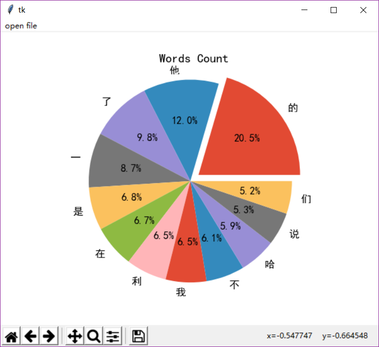
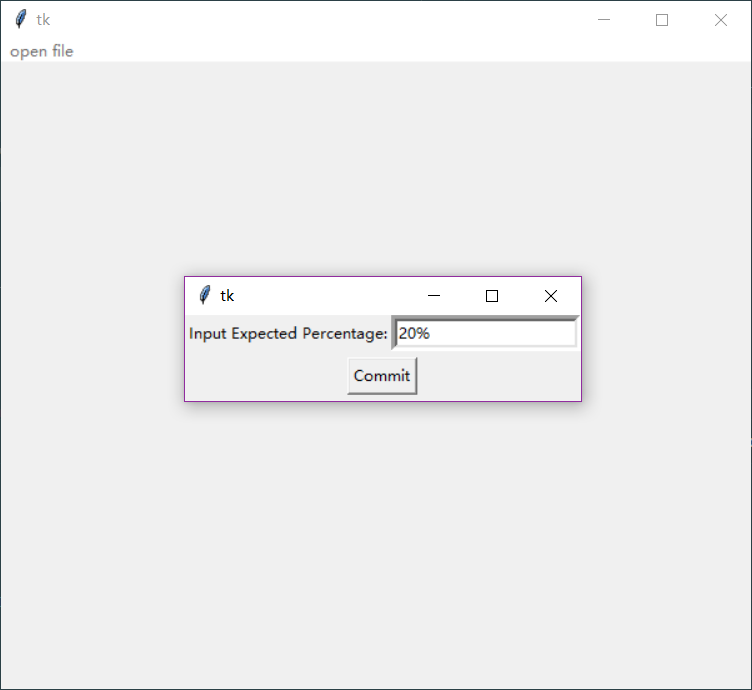
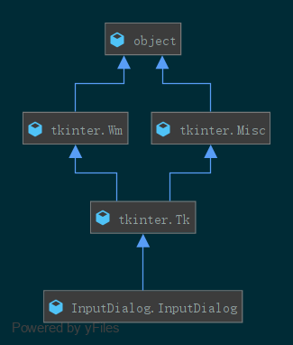

# Word Count

# Dependency

- matplotlib
- tkinter
- re
- threading

# Usage 

    python MainWindow.py

选择文件打开，并且输入所需显示的出现频率百分数

# Structure

## File Structure

- demo (存放展示图片) 
- test (存放单元测试文件)
    - test_arc.py (matplotlib.pyplot绘图测试)
    - test_embedded_tk.py (tkinter窗体内嵌pyplot测试)
    - test_thread.py (多线程绘图测试)
    - wordCount.py (文本文件计数测试)
    - wordGenerate.py (生成测试所用文本文件)
 - venv (python虚拟环境)
 - InputDialog.py (输入对话框类)
 - MainWindow.py (主窗体类，程序入口)
 - .gitignore
 - README.md (readme)
 - book.txt (哈利波特)
 - 西游记.txt (西游记)
 
 # Class Hierarchy
 

- **MainWindow.MainWindow**类字段root作为主窗体，实现代码主逻辑，聚合InputDialog.InputDialog
- **InputDialog.InputDialog**类继承tkinter窗体，实现输入框功能
 
# Implementation

- tkinter与matplotlib结合，利用tkinter的canvas实现对pyplot的绘制
- 利用matplotlib提供的NavigationToolbar2Tk将pyplot的导航栏内嵌到tkinter窗体中
- 利用tkinter的打开文件对话框实现对文件的获取
- InputDialog作为子窗体循环，quit函数将控制权返回给主窗体循环
- 利用threading模块另开线程读取文件进行文字统计，从而不影响窗体循环，使得用户可以继续进行操作
- 利用re模块进行正则匹配筛选文本

# Feature

- 面向对象，逻辑简洁
- 单元测试，代码可靠
- 窗体循环，可多次查看不同文件不同比率字数统计情况
- 多线程处理数据，对于内容庞大/统计比率较高的文件体验好
- 内嵌导航栏，功能齐全